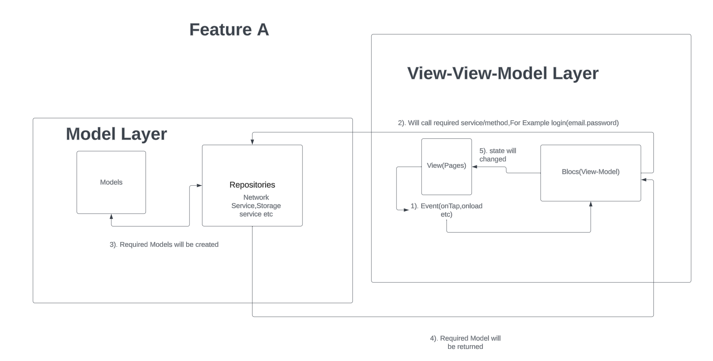

# Flutter Portfolio Document

## Architecture: MVVM (Model–View–View Model)

> Reference Blog: https://medium.com/flutterworld/flutter-mvvm-architecture-f8bed2521958

## Folder Structure

- core: Core will have global configuration for `routing`, `assets` and `fonts` Management and `Blocs/Cubit` states.

  - `gen`: Will have auto generated assets and fonts
  - `blocs`: Will have only those blocs which can be used globally in any feature for example `AppVersionCubit` can be used in any required feature with global configuration
  - `model`: this folder will contain those models which can be used globally in application for example `NetworkSuccessResponse` and `NetworkErrorResponseModel`
  - `routing`: Auto generated routing using [auto_route](https://pub.dev/packages/auto_route).
  - `utils`: Will have utility functions which will help as helper methods for implementing any features,example `StorageService` and `NetworkService`
  - `Widget`: Flutter stateless widget that can be used through out all the features.

- Features: It will contain hierarchical folder structure based on the features,
  - `featureA`:
    - `data`
      - `models`: Will have Models related to this feature
      - `repo`: Repositories is singleton class,for implementing any feature
    - `presentations`: All the UI/UX Handling will be inside `presentations` layer of the feature. -`pages`: widgets for screens,will be available for routing.
      - `widgets`: stateless reusable Widgets for specific features.
      - `Blocs`: Blocs/Cubit for handling states

## Casing

- folder name should follow **Kebab-case**,for example `/lib/features/featuresA/data/repo/patient-repo/`
- File name should follow **lowercase_with_underscores**,for example `/lib/features/featuresA/data/repo/patient-repo/patient_repo.dart`

## Print Logs

- **Do not use `print`,`debugPrint`, or `log` from `'dart:developer/developer.dart;'`**
- use `log(message)` from `import 'package:dementia_app/core/utils/logger.dart';`

## Data Flow Diagram



## Add CopyWith function to class for immutable classes

- Create a file lets say `feature_a_model.dart`

```
//include this
part of 'feature_a_model.g.dart';
@CopyWith()
class FeatureA{
final String message;
const Feature({required this.message});
}
```

- Run build_runner `dart run build_runner build`

## Add New Features in Application

Let's create a new feature in application to fetch list of users to display in patient list.

- Create a folder in `lib\features`,lets called it `my_patient`.
- Create a folder data which has 2 folders `models` and `repo`
- Create models for results that has to expected to be returned from APIs(use this to convert json to dart class https://dart-quicktype.netlify.app/).
- Create a repo,lets called `patients_repo.dart` and class `PatientRepo`.
- Create a function for calling API.
- ```
  class PatientRepo{
  Future<Result<PatientModel>> fetchPatients()async {
  //TODO: Implement logic for calling API
  };
  }
  ```

### How to Make Network Call

- Add your Endpoint in `Endpoints` class as static Member or if already created use that.
- Available Types of Network Request
  GET,POST,PUT,DELETE,PATCH
- Method for calling API

```
//String apiVersion = EndPoints.apiVersion having default value is not specified in method call,`api/v1'.""
 Future<Result<NetworkSuccessResponse>> getRequest({
    required String endPoint,
    Map<String, String?>? queryParams,
    String apiVersion = EndPoints.apiVersion,
    bool fromCache = false, // if you have to fetch from cache if exists,then send it true
    bool toCache = false, // if you have to write or update cache send it true
  });
  Future<Result<NetworkSuccessResponse>> postRequest({
    required String endPoint,
    required Map<String, dynamic> body,
    Map<String, String?>? queryParams,
    String apiVersion = EndPoints.apiVersion,
    bool fromCache = false, // if you have to fetch from cache if exists,then send it true
    bool toCache = false, // if you have to write or update cache send it true
  });
  Future<Result<NetworkSuccessResponse>> putRequest({
    required String endPoint,
    required Map<String, dynamic> body,
    Map<String, String?>? queryParams,
    String apiVersion = EndPoints.apiVersion,
  });
  Future<Result<NetworkSuccessResponse>> deleteRequest({
    required String endPoint,
    required Map<String, dynamic> body,
    Map<String, String?>? queryParams,
    String apiVersion = EndPoints.apiVersion,
  });
  Future<Result<NetworkSuccessResponse>> patchRequest({
    required String endPoint,
    required Map<String, dynamic> body,
    Map<String, String?>? queryParams,
    String apiVersion = EndPoints.apiVersion,
  });

```

- Make GET request: Suppose The following endpoint is going to return following object as success response.

```
class PatientRepo {
  Future<Result<PatientModel>> fetchPatients() async {
      final res = await NetworkServiceImpl.instance.getRequest(
        endPoint: EndPoints.getPatients,
        fromCache:false,
      );

      // Check if response is successful
      if (res is Success<NetworkSuccessResponse>) {
        // Parse the response and return the result
        //Parse json data from to class object
      final patientParse = JsonConverter<PatientModel>(
        res.data.data,
        (json) => PatientModel.fromJson(res.data),
      ).convert()
      //check if parsing successfully succeeded or not,if not throw error code

      return patientParse is Success<PatientModel>
          ? Success<PatientModel>(data: patientParse.data)
          : Failure(
              errorType: (patientParse as Failure).errorType,
              details: (patientParse as Failure).details,
            );
      }
       // Return failure with details from the network request
        return Failure(
          errorType: (res as Failure).errorType,
          details: (res as Failure).details,
        );
  }
}

```

- Now create a presentation folder in `lib/features/my_patients`, this will have 4 folder(4th is optional)
  - `Widgets`: Add stateless(preferred) class widget that can be reusable through this feature.
    - `Pages`: Pages,where you can navigate.
      - `my_patients_page.dart`:Create a stateless class to load patient profiles
      - ```
        @RoutePage(name: 'MyPatientView') // for routing purpose,name is optional perameter
        class MyPatientPage extends StatelessWidget{}
        ```
      - use build runner to create code generator for routing
        - `dart run build_runner watch`
        - if error occurs,run `flutter pub get` and rerun command again.
      - After successfully executing code generator,create a route in `core/routing/routes.dart`.

```
        final List<AutoRoute> routes = <CustomRoute>[
        //add new route here, like this
        CustomRoute(path: '/my_patients', page: MyPatientView.page),
        ];
```

- Routing without context

```
//example for push and pop until
appRouter.pushAndPopUntil(
          const MyPatientView(),
          predicate: (route) => false,
        );
```

- Routing with context

```
context.router.pushAndPopUntil(
          const MyPatientView(),
          predicate: (route) => false,
        );
```

- Inside `Presentation` create `Blocs` for state-management.
  - `my_patient_bloc.dart`:For handling event
  - `my_patient_state.dart`: For different states
  - `my_patient_event.dart`: For defining events

> NOTE: When you have more than 2 states and multiple events then use blocs otherwise use cubit for single and 2 states widget. For cubit better to use single class state and update state with copy with method.

### How to add assets and use them

- Add assets in assets folder,either font and images
- Run `flutter pub get` and then run `dart run build_runner watch`. //for avoiding hardcode asset path and fonts

```
    Container(
          decoration: BoxDecoration(
            image: DecorationImage(
              fit: BoxFit.fill,
              image: Assets.images.splashScreen.provider(), // this is how to use assets as provider
              opacity: 0.1,
            ),
            gradient: LinearGradient(
              colors: [
                darkGradient.withOpacity(.9),
                lightGradient.withOpacity(.9),
              ],
            ),
          )

```

## How to Upload file

- Use `ImagePickerUtils` to pickImage that return `Result<XFile>` by providing source.

```
  final uploadNetwork = await NetworkServiceImpl.instance.uploadSingleFile(
                  metaData: UploadFileMetaData(
                    file: <XFile>
                    fileType: FileTypes.image // file types available enum FileTypes { image, video, document },
                    featureName: '<Feature_Name>',
                  ),
                );
                Utility.closeDialog();
                if (uploadNetwork is Success<UploadedFileModel>) {
                  Utility.showSuccessToast(
                    title: 'File has been uploaded',
                  );

                  return;
                } else {
                  Utility.showErrorToast(
                    title: (uploadNetwork as Failure).message,
                  );
                }

```

## Hive and Flutter Secure Storage

- We are using 2 different strategies for storing data in local
- `flutter_secure_storage` is used for storing single key-pair based value,For Example `isLogin`,`token` and data which is very crucial for encryption.
- `Hive` is being is used for storing whole Object with help of `flutter_secure_storage` to keep the secret key of `Hive.Box` into this flutter secure storage.

## How to use Flutter Secure Storage

- Use `StorageService` to access basic functionality like read,write,delete and read all and write all etc.
  Available Methods:
  - Read Single Value
  ```
      // Retrieves the value associated with the given key from secure storage
      static Future<Result<String>> getValue(String key);
  ```
  - Writes the single value
  ```
     // Saves the given key-value pair to secure storage
  static Future<Result<bool>> saveValue(String key, String value);
  ```
  - Writes the multiple values
  ```
  // Saves all key-value pairs in the given map to secure storage
  static Future<Result<bool>> saveAll(Map<String, String?> data);
  ```
  - Delete multiple keys
  ```
    // Deletes all values associated with the given keys from secure storage
  static Future<Result<bool>> deleteValues(List<String> keys);
  ```
  - Delete Single Key
  ```
   // Deletes the value associated with the given key from secure storage
  static Future<Result<bool>> deleteValue(String key);
  ```
  - Delete All keys
    ```
      // Deletes all key-value pairs from secure storage
       static Future<Result<bool>> deleteAll();
    ```

### How to use Hive Box

- Read about Hive box,[here](https://medium.com/codex/hive-in-flutter-7a2b320eb1dc)
- Instantiate the `HiveStorage` class: `HiveStorage<T> hiveStorage = HiveStorage<T>()`;
- Make sure to replace `<T>` with the type of data you want to store or read in the box.
- Call the `openBox` method on the `hiveStorage` object, passing the name of the box you want to open:
- String boxName = 'myBox';
  ```
  Result<Box<T>> result = await hiveStorage.openBox(boxName);
  ```
- Check the result to see if the box was opened successfully:
  ```
  if (result is Success<Box<T>>) {
  Box<T> box = result.data;
  // Use the box for storing and retrieving data
  } else if (result is Failure<Box<T>>) {
  // Handle the failure case
  }
  ```
